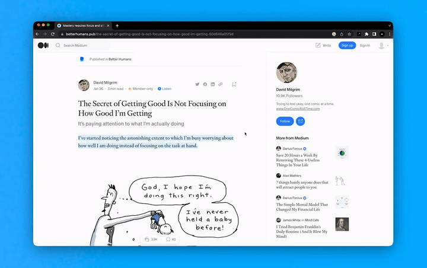

<h1 align="center"> Quickfix AI (Alpha Release)</h1>

<h3 align="center">Search on page better than Chrome Find tool.</h3>

## Introduction 👋

Quickfix AI is a Chrome extension that provides you **instant answer of queries about the current webpage** using AI.

With Quickfix AI, you can:
- ⏳ Instant Answers: Quick and accurate results with GPT technology.
- 🔍 Semantic Search: Precise answers based on word meaning.
- 🧠 Human-like Responses: Natural language responses for easy comprehension.
- 💡 Vector Search: Efficient search on large webpages, without exceeding GPT token limit.

## Demo 📽

*If the demo video is not loading for you, [watch it on YouTube](https://www.youtube.com/watch?v=HSwEL4RStTI).*

## Why Quickfix AI? 🤔

Google Chrome's Find tool lacks the ability to understand the semantic nature of words. Existing tools and extensions only search based on keywords, pattern matching, and regex, limiting their effectiveness.

I was looking for a more advanced solution to quickly obtain relevant information from web pages. Therefore, I developed Quickfix AI, which utilizes GPT technology to enable users to ask questions and receive accurate, human-like responses about the webpage they are on. This extension aims to provide a more efficient and effective way of searching for information on web pages.

Now let's get started!

## Installation 📦

Quickfix AI is in its Alpha phase, if you would like to use and explore it at this stage, you can follow the steps below to set it up. However, if you prefer to wait for a more reliable version with an easy installation process through Chrome Web Store, you can [Join the Waitlist](https://forms.gle/ZN4hmSuThpYAE8kZ7) for the Stable release.

**Prerequisite:**

- Python v3.10 + Poetry

**Setup:**

1. Clone the Quickfix AI repo.
2. Change your directory to the backend by using the command `cd backend`.
3. Install backend dependencies by running `make install-backend`.
4. Run the backend using `make run-backend`.
5. Update the environment variables in both files: `/chrome-extension/env.js` [^1] and `/backend/.env`.
6. Enable Developer mode in Google Chrome by visiting `chrome://extensions`.
7. `Load unpacked` Quickfix AI chrome-extension folder.

## How to use Quickfix AI 🚀

1. Visit a webpage you want to search on.
2. Launch the Quickfix AI chrome extension.
3. Ask a question.
4. Quickfix AI will display the answer.

Enjoy the instant Search On Page with Quickfix AI! 🎉

[^1]: You probably don't need to update `/chrome-extension/env.js` file if your backend will be running on localhost or 127.0.0.1.